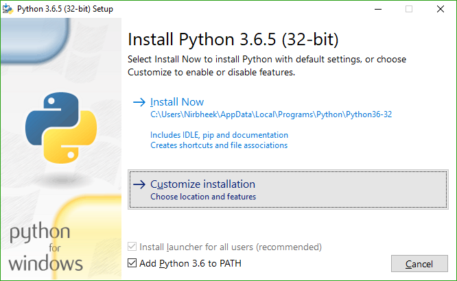
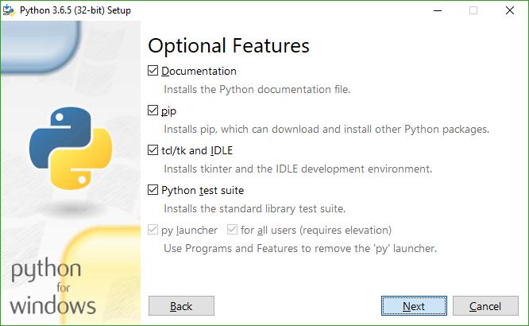
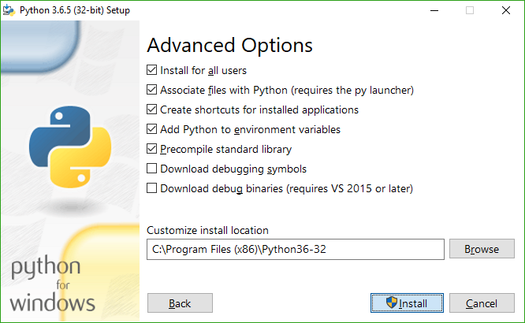

# Getting meson-ui

Meson-UI is implemented in Python 3, and requires 3.6 or newer. If your operating
system provides a package manager, you should install it with that. For
platforms that don't have a package manager, you need to download it from
[Python's home page]. See below for [platform-specific Python3
quirks](#platformspecific-install-quirks).

## Downloading Meson-UI

Meson-UI releases can be downloaded from the [GitHub release page], and you can
run `./meson-ui.py` from inside a release or the git repository itself without
doing anything special.

On Windows, if you did not install Python with the installer options that make
Python scripts executable, you will have to run `python /path/to/meson-ui.py`,
where `python` is Python 3.6 or newer.

The newest development code can be obtained directly from [Git], and we strive
to ensure that it will always be working and usable. All commits go through
a pull-request process that runs CI and tests several platforms.

## Installing Meson-UI with pip

Meson-UI is available in the [Python Package Index] and can be installed with
`pip3 install meson-ui` which requires root and will install it system-wide.

Alternatively, you can use `pip3 install --user meson-ui` which will install it
for your user and does not require any special privileges. This will install
the package in `~/.local/`, so you will have to add `~/.local/bin` to your
`PATH`.

## Installing Meson-UI with snap

*TODO*

## Dependencies

In the most common case, you will need the [Ninja executable] for using the
`ninja` backend, which is the default in Meson. This backend can be used on all
platforms and with all toolchains, including GCC, Clang, Visual Studio, MinGW,
ICC, ARMCC, etc.

You can use the version provided by your package manager if possible, otherwise
download the binary executable from the [Ninja project's release
page](https://github.com/ninja-build/ninja/releases).

-----------------------------------------------------------------------------------------------------------------
| Python Package Index.                   | Tool Home Page                                    |  Version Needed  |
|-----------------------------------------|---------------------------------------------------|------------------|
| [PyQt5](https://pypi.org/project/PyQt5) | N/A                                               | 5.14.1 or newer. |
| [Meson](https://pypi.org/project/meson) | [Meson Build Home Page](https://mesonbuild.com/)  | 0.54.0 or newer. |
| [Ninja](https://pypi.org/project/ninja) | [Ninja Build Home Page](https://ninja-build.org/) | 1.9.0 or newer.  |

# Platform-specific install quirks

## Windows Python3 quirks

When installing Python 3, it is highly recommended (but not required) that you
select the installer options as follows:

With this, you will have `python` and `pip` in `PATH`, and you can install
Meson-UI with pip. You will also be able to directly run `meson-ui` in any shell on
Windows instead of having to run `py -3` with the full path to the `meson-ui.py`
script.

  [GitHub release page]: https://github.com/michaelbadcrumble/meson-ui/releases
  [Python Package Index]: https://pypi.python.org/pypi/meson-ui/
  [Git]: https://github.com/mesonbuild/meson-ui
  [Python's home page]: https://www.python.org/downloads/
  [Ninja executable]: https://ninja-build.org/
